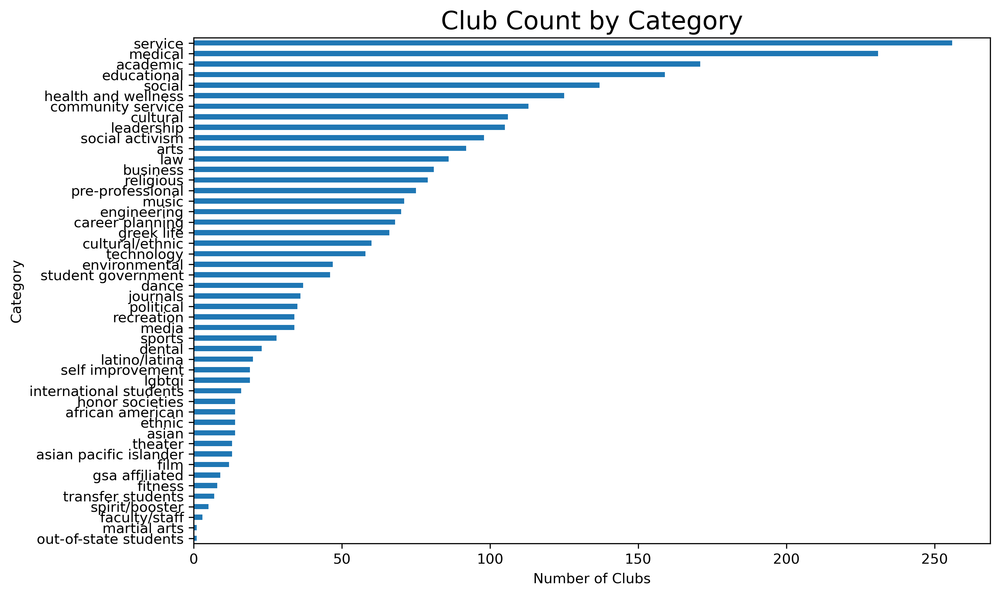

# UCLA Clubs Explorer
**Course**: STATS 418  
**Student**: Hengyuan (David) Liu  
**Quarter**: Spring 2025

This Shiny application helps UCLA students discover and explore student organizations based on their interests. The app provides interactive visualizations and search capabilities to make club discovery easier and more intuitive.

There are three urls can access this app:

1. Shinyapp: https://hengyuanliu.shinyapps.io/uclaclubs/
2. Google Cloud Run: https://ucla-clubs-app-980752141572.us-west1.run.app
3. My own domain: https://uclaclubs.hyl.gd.edu.kg/

The web app structures is using the two API I created and deploied by Google Cloud Run, you can check the detail by these Githubs:

1. KNN API Github: https://github.com/DavidLiu0619/ucla-clubs-knn-api
2. Gemini+RAG API Github: https://github.com/DavidLiu0619/ucla-clubs-rag-api

## Data Source

The application uses cleaned and processed data from the UCLA Student Organizations database: https://community.ucla.edu/studentorgs
Note: The data is webscrapped on April 27, 2025, so the data might be different while you seeing now. 

## Exploratory Data Analysis

| Metric             | Count  |
|--------------------|--------|
| Total Categories   | 48     |
| Total Club Records | 2,829  |
| Unique Clubs       | 1,439  |

### Distribution of Clubs by Category



<video src="assests/short_demo.mp4" controls="controls" style="max-width: 730px;">
</video>


## Features

### Demo Video
[https://github.com/DavidLiu0619/ucla-clubs-app/assets/short_demo.mp4?raw=true](https://github.com/user-attachments/assets/13da64fd-984d-4a29-a0fe-8f9d0ab5b7b7)

- **Interactive Visualizations**:
  - The user can select multiple Club Categories, and it will show:
    - Bar plots showing club distribution by categories
    - Bar plots of the most common words
    - Word cloud showing common themes across clubs
- **KNN Similarity Club Finder**:
  - The user can input the keywords and number of results
    - The table includes: Name of Clubs, Category, Clickable Link, and Similarity Score
- **Club Chatbot**: 
  - An AI Agent based on RAG Framework and Gemini API
  - The user can ask questions, and the chatbot can answer.

## Repository Structure

| File/Directory | Description |
|----------------|-------------|
| `code/` | Contains the Webscrapping and EDA code |
| `docker/` | Docker configuration files and setup scripts |
| `.dockerignore` | Specifies which files Docker should ignore |
| `deploy-to-shinyapps.R` | Script for deploying to shinyapps.io |

## Local Development

### Prerequisites
- R (version 4.0 or higher)
- Required R packages (can be installed using `install_packages.R`):
  - shiny
  - dplyr
  - ggplot2
  - wordcloud
  - wordcloud2
  - and other dependencies

### Running Locally with Docker

1. Clone this repository:
```bash
git clone https://github.com/DavidLiu0619/ucla_clubs_app.git
cd ucla_clubs_app
cd docker
```

2. Build and run using Docker:
```bash
docker compose up -d
```

3. Access the application at `http://localhost:8080`

4. Stop Docker:
```bash
docker compose down -v
```

## Deployment

The application can be deployed to shinyapps.io using the provided `deploy-to-shinyapps.R` script.

## License

This project is licensed under the terms of the license included in the repository.
